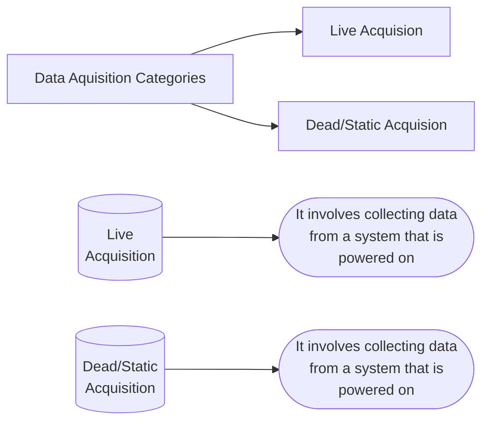
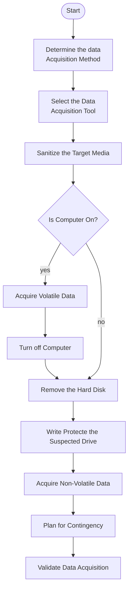

# Data Acquisition and Duplication

Data Acquisition is the use of established methods to extract Electronically Stored Information (ESI) from suspect computer or storage media to gain insights into a crime or an incident.

Investigator must be able to verify the accuracy of acquired data, and the complete process should be auditable and acceptable in the court.

## Live Acquisition

- Live data acquisition involves collecting volatile data from  a live system.
- Volatile information assists in determining the logical timeline of the security incident, and the possible users responsible.
- Live acquisition can then be followed by static/dead acquisition, where an investigator shuts down the suspect machine, removes the hard disk and then acquires its forensic image.

### Types of data captured during live acquisition

1. **System Data**
    1. Current Configuration
    2. Running Processes
    3. Running State
    4. Logged on users
    5. Date and Time
    6. DLLs or shared Libraries
    7. Swap files and temp files
    8. Current system uptime

1. **Network Data**
    1. Routing tables
    2. ARP cache
    3. Network configuration
    4. Network connections
- When collecting evidence, an investigator needs to evaluate the **order of volatility** of the data. And the more volatile data should be acquired first.
- According to the RFC 3227, the order of volatility for a typical system:
    1. Registers and cache
    2. Routing table, Process table, kernel statistics, and memory
    3. Temporary system files (generally stored in HDDs or SSDs)
    4. Disk or other storage media
    5. Remote logging and monitoring data that is relevant for the system in question.
    6. Physical Configuration and network topology
    7. Archival media

## Dead Acquisition

- It is the acquisition of data from a suspect machine that is powered off.
- It involves acquiring data from storage devices such as **hard drives, USB drives, smart phones** etc.
- Examples; emails, word docs, web activity, spreadsheets, slack space, unallocated drive  space, and various deleted files

# Rules for Data Acquisition

1. Do not work on original digital evidence. Create a bit-stream/logical image of suspicious drive/file to work on.
2. Use clean media to store the copies.
3. Produce two or more copies of the original media.
    1. The first is the working copy for analysis.
    2. The other copies act as the library/control copies that are stored for disclosure purposes or in the event that the working copy gets corrupt.
4. Upon creating copies of original media, verify the integrity of copies with the original.

# Types of Data Acquisition

### Logical Acquisition

- It allows an investigator to capture only selected files or file types of interest to the case.
- Examples;
    - Email investigation that requires collection of Outlook .pst or .ost files
    - Collecting specific records from a large RAID server.

### Sparse Acquisition

- Sparse acquisition is similar to logical acquisition, which in addition collects fragments of in unallocated data, allowing investigators to acquire deleted files.
- Use this method when inspection of the entire drive is not required.

## Bit-Stream Imaging

It creates a bit-by-bit copy of a suspect drive, which is cloned copy of the entire drive including all its sectors and clusters, which allows forensic investigators to retrieve deleted files or folder.

### Bit-stream disk-to-image(D2I) file.

- It is the most common method used by forensic investigators.
- The created image file is a bit-by-bit replica of the suspect drive.
- Tools used: ProDiscover, EnCase, FTK, The Sleuth Kit, X-Ways Forensics etc.

### Bit-stream disk-to-disk(D2D)

- Disk-to -Image copying is not possible in situations where
    - The suspect drive is very old and incompatible with the imaging software
    - Investigators need to recover credentials used for websites and user accounts.
- To overcome this situation, investigators can create a disk-to-disk bit-stream copy of the target media.
- While creating D2D copy, investigators can adjust target disk’s geometry (its head, cylinder, and track configurations) to align with suspects drive.
- Tools  used: Encase, Tableau Forensic Imager, etc.

# Data Acquisition Format

## Raw Format

It creates bit-by-bit copy of the suspect drive. Image in this format were are usually obtained by using the dd commands.

### Advantages

- Fast data transfers
- Minor data read errors on source drive are ignored
- Ready by most of the forensics tools

### Disadvantages

- Requires same amount of storage as that of the original media
- Tools might fail to recognize/collect marginal (bad) sectors from the suspect drive

## Proprietary Format

- Commercial forensics tools acquire data from the suspect drive and save the image files in their own formats

**They offer certain features which include the following:**

- Option to compress the image files of the evidence disk/drive in order to save space on the target media.
- Ability to split an image into multiple segments, in order to save them to smaller target media such as CD/DVD, while maintaining their integrity.
- Ability to incorporate metadata into the image file, which includes date and time of acquisition, hash values of the files, case details

**Disadvantage:**

Image file format created by one tool may not be supported by other tool(s).

## Advance Forensics Format (AFF)

It is a open source acquisition format with the following design goals.

- No size limitation for disk-to-image files
- Option to compress the image files
- Allocates space to record metadata of the image files
- Simple design and customizable
- Accessible through multiple computing platforms and OSes
- Internal consistency checks for  self-authentication

File extensions include .amf for AFF metadata and .afd for segmented image files.

## Advance Forensic Framework 4 (AFF4)

1. Redesign and revision of AFF to manage and use large amount of disk images, reducing both acquisition time and storage requirements
2. Basic types of AFF4 objects: volumes, streams, and graphs. They are universally referenced through a unique URL.
3. Abstract information model that allows storage of disk-image data in one or more-places while the information about the data is stored elsewhere.
4. Stores more kinds of organized information in the evidence file.
5. Offers unified data model and naming scheme.

# Data Acquisition Methodology

[Detailed Steps of Data Acquisition Methodology](https://app.notion.com/p/Detailed-Steps-of-Data-Acquisition-Methodology-2510f2020f4880f9a7ffefc8d97a5f7f?pvs=21)